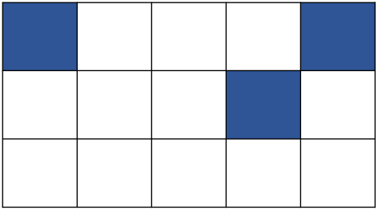

# SAT-Solver-for-Tiling-Dominoes
A SAT solver that outputs DIMACS format SAT encodings without using MiniSat or Satispy.

This was done as a final project for my Theory of Computation Class.

# Example
Given a rectangular grid with some of the squares blocked off, can the remaining squares be covered with non-overlapping dominos? 

Input will be a string in the format of: 3,5,(1,1),(1,5),(2,4)

Output will be a printed out string of the DIMACS format SAT encodings:

# Special Thanks
@msoos for his incredible online SAT solver, which can be found here: https://msoos.github.io/cryptominisat_web/
